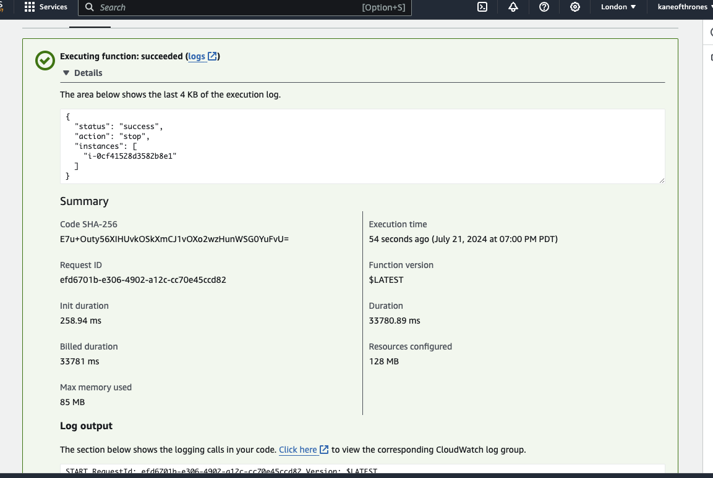
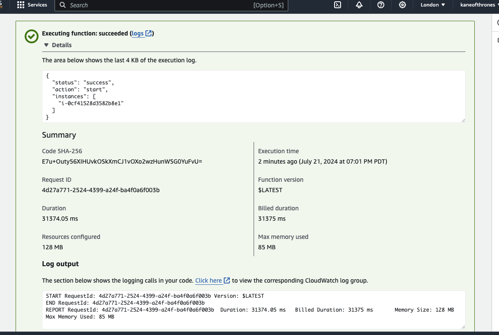

# EC2 Control Lambda Function

This AWS Lambda function starts and stops EC2 instances based on their tags.

## Project Structure

```ec2_control_lambda/
├── src/
│   ├── ec2_control.py
│   └── requirements.txt
├── scripts/
│   └── package_lambda.sh
├── terraform/
│   ├── main.tf
│   ├── variables.tf
│   └── outputs.tf
└── README.md
```

## Requirements

### Tools

1. **AWS CLI**: To configure and manage AWS services from the command line.
   - Installation: [AWS CLI Installation](https://docs.aws.amazon.com/cli/latest/userguide/install-cliv2.html)

2. **Terraform**: For infrastructure as code (IaC) to deploy the Lambda function and other AWS resources.
   - Installation: [Terraform Installation](https://learn.hashicorp.com/tutorials/terraform/install-cli)

3. **Python**: To run the Lambda function script.
   - Installation: [Python Installation](https://www.python.org/downloads/)

### AWS Credentials

Make sure the aws IAM role you use has the following permissions

```{
    "Version": "2012-10-17",
    "Statement": [
        {
            "Effect": "Allow",
            "Action": [
                "iam:CreateRole",
                "iam:AttachRolePolicy",
                "iam:PutRolePolicy",
                "iam:DeleteRolePolicy",
                "iam:DeleteRole",
                "iam:UpdateAssumeRolePolicy",
                "iam:GetRole",
                "iam:PassRole"
            ],
            "Resource": "*"
        },
        {
            "Effect": "Allow",
            "Action": [
                "lambda:CreateFunction",
                "lambda:UpdateFunctionCode",
                "lambda:UpdateFunctionConfiguration",
                "lambda:InvokeFunction",
                "lambda:GetFunction",
                "lambda:DeleteFunction"
            ],
            "Resource": "*"
        },
        {
            "Effect": "Allow",
            "Action": [
                "ec2:DescribeInstances",
                "ec2:StartInstances",
                "ec2:StopInstances"
            ],
            "Resource": "*"
        },
        {
            "Effect": "Allow",
            "Action": [
                "s3:ListBucket",
                "s3:GetObject",
                "s3:PutObject",
                "s3:DeleteObject"
            ],
            "Resource": "*"
        },
        {
            "Effect": "Allow",
            "Action": [
                "dynamodb:PutItem",
                "dynamodb:GetItem",
                "dynamodb:DeleteItem",
                "dynamodb:UpdateItem",
                "dynamodb:Scan",
                "dynamodb:Query"
            ],
            "Resource": "*"
        }
    ]
}
```

## Deployment

1. **Package the Lambda Function:**

    ```bash
    bash scripts/package_lambda.sh
    ```

2. **Deploy with Terraform:**

    ```bash
    cd terraform
    terraform init
    terraform apply
    ```

## Terraform plan

```Terraform will perform the following actions:
  # aws_iam_role.lambda_exec will be created
  + resource "aws_iam_role" "lambda_exec" {
      + arn                   = (known after apply)
      + assume_role_policy    = jsonencode(
            {
              + Statement = [
                  + {
                      + Action    = "sts:AssumeRole"
                      + Effect    = "Allow"
                      + Principal = {
                          + Service = "lambda.amazonaws.com"
                        }
                      + Sid       = ""
                    },
                ]
              + Version   = "2012-10-17"
            }
        )
      + create_date           = (known after apply)
      + force_detach_policies = false
      + id                    = (known after apply)
      + managed_policy_arns   = (known after apply)
      + max_session_duration  = 3600
      + name                  = "lambda_exec_role"
      + name_prefix           = (known after apply)
      + path                  = "/"
      + tags_all              = (known after apply)
      + unique_id             = (known after apply)
      + inline_policy (known after apply)
    }
  # aws_iam_role_policy_attachment.lambda_basic_execution will be created
  + resource "aws_iam_role_policy_attachment" "lambda_basic_execution" {
      + id         = (known after apply)
      + policy_arn = "arn:aws:iam::aws:policy/service-role/AWSLambdaBasicExecutionRole"
      + role       = "lambda_exec_role"
    }
  # aws_iam_role_policy_attachment.lambda_ec2_execution will be created
  + resource "aws_iam_role_policy_attachment" "lambda_ec2_execution" {
      + id         = (known after apply)
      + policy_arn = "arn:aws:iam::aws:policy/AmazonEC2FullAccess"
      + role       = "lambda_exec_role"
    }
  # aws_lambda_function.ec2_control will be created
  + resource "aws_lambda_function" "ec2_control" {
      + architectures                  = (known after apply)
      + arn                            = (known after apply)
      + code_sha256                    = (known after apply)
      + filename                       = "./../ec2_control_lambda.zip"
      + function_name                  = "ec2_control_lambda"
      + handler                        = "ec2_control.lambda_handler"
      + id                             = (known after apply)
      + invoke_arn                     = (known after apply)
      + last_modified                  = (known after apply)
      + memory_size                    = 128
      + package_type                   = "Zip"
      + publish                        = false
      + qualified_arn                  = (known after apply)
      + qualified_invoke_arn           = (known after apply)
      + reserved_concurrent_executions = -1
      + role                           = (known after apply)
      + runtime                        = "python3.8"
      + signing_job_arn                = (known after apply)
      + signing_profile_version_arn    = (known after apply)
      + skip_destroy                   = false
      + source_code_hash               = "QCIEYa65xHiYnGRVyqv7JaT0AxraL7mP4AY3yevRUMc="
      + source_code_size               = (known after apply)
      + tags_all                       = (known after apply)
      + timeout                        = 60
      + version                        = (known after apply)
      + environment {
          + variables = {
              + "LOG_LEVEL" = "INFO"
            }
        }
      + ephemeral_storage (known after apply)
      + logging_config (known after apply)
      + tracing_config (known after apply)
      + vpc_config {
          + ipv6_allowed_for_dual_stack = false
          + security_group_ids          = (known after apply)
          + subnet_ids                  = (known after apply)
          + vpc_id                      = (known after apply)
        }
    }
  # aws_security_group.lambda_sg will be created
  + resource "aws_security_group" "lambda_sg" {
      + arn                    = (known after apply)
      + description            = "Managed by Terraform"
      + egress                 = [
          + {
              + cidr_blocks      = [
                  + "0.0.0.0/0",
                ]
              + from_port        = 0
              + ipv6_cidr_blocks = []
              + prefix_list_ids  = []
              + protocol         = "-1"
              + security_groups  = []
              + self             = false
              + to_port          = 0
                # (1 unchanged attribute hidden)
            },
        ]
      + id                     = (known after apply)
      + ingress                = [
          + {
              + cidr_blocks      = [
                  + "0.0.0.0/0",
                ]
              + from_port        = 443
              + ipv6_cidr_blocks = []
              + prefix_list_ids  = []
              + protocol         = "tcp"
              + security_groups  = []
              + self             = false
              + to_port          = 443
                # (1 unchanged attribute hidden)
            },
        ]
      + name                   = "lambda_security_group"
      + name_prefix            = (known after apply)
      + owner_id               = (known after apply)
      + revoke_rules_on_delete = false
      + tags                   = {
          + "Name" = "lambda_security_group"
        }
      + tags_all               = {
          + "Name" = "lambda_security_group"
        }
      + vpc_id                 = (known after apply)
    }
  # aws_subnet.subnet_a will be created
  + resource "aws_subnet" "subnet_a" {
      + arn                                            = (known after apply)
      + assign_ipv6_address_on_creation                = false
      + availability_zone                              = "eu-west-2a"
      + availability_zone_id                           = (known after apply)
      + cidr_block                                     = "10.0.1.0/24"
      + enable_dns64                                   = false
      + enable_resource_name_dns_a_record_on_launch    = false
      + enable_resource_name_dns_aaaa_record_on_launch = false
      + id                                             = (known after apply)
      + ipv6_cidr_block_association_id                 = (known after apply)
      + ipv6_native                                    = false
      + map_public_ip_on_launch                        = false
      + owner_id                                       = (known after apply)
      + private_dns_hostname_type_on_launch            = (known after apply)
      + tags                                           = {
          + "Name" = "subnet_a"
        }
      + tags_all                                       = {
          + "Name" = "subnet_a"
        }
      + vpc_id                                         = (known after apply)
    }
  # aws_subnet.subnet_b will be created
  + resource "aws_subnet" "subnet_b" {
      + arn                                            = (known after apply)
      + assign_ipv6_address_on_creation                = false
      + availability_zone                              = "eu-west-2b"
      + availability_zone_id                           = (known after apply)
      + cidr_block                                     = "10.0.2.0/24"
      + enable_dns64                                   = false
      + enable_resource_name_dns_a_record_on_launch    = false
      + enable_resource_name_dns_aaaa_record_on_launch = false
      + id                                             = (known after apply)
      + ipv6_cidr_block_association_id                 = (known after apply)
      + ipv6_native                                    = false
      + map_public_ip_on_launch                        = false
      + owner_id                                       = (known after apply)
      + private_dns_hostname_type_on_launch            = (known after apply)
      + tags                                           = {
          + "Name" = "subnet_b"
        }
      + tags_all                                       = {
          + "Name" = "subnet_b"
        }
      + vpc_id                                         = (known after apply)
    }
  # aws_vpc.main will be created
  + resource "aws_vpc" "main" {
      + arn                                  = (known after apply)
      + cidr_block                           = "10.0.0.0/16"
      + default_network_acl_id               = (known after apply)
      + default_route_table_id               = (known after apply)
      + default_security_group_id            = (known after apply)
      + dhcp_options_id                      = (known after apply)
      + enable_dns_hostnames                 = (known after apply)
      + enable_dns_support                   = true
      + enable_network_address_usage_metrics = (known after apply)
      + id                                   = (known after apply)
      + instance_tenancy                     = "default"
      + ipv6_association_id                  = (known after apply)
      + ipv6_cidr_block                      = (known after apply)
      + ipv6_cidr_block_network_border_group = (known after apply)
      + main_route_table_id                  = (known after apply)
      + owner_id                             = (known after apply)
      + tags                                 = {
          + "Name" = "main_vpc"
        }
      + tags_all                             = {
          + "Name" = "main_vpc"
        }
    }
Plan: 8 to add, 0 to change, 0 to destroy.

Changes to Outputs:
  + lambda_function_name = "ec2_control_lambda"
```

## CI/CD extra steps

### Setup remote backend

**Create an S3 bucket** 

```aws s3api create-bucket --bucket <bucket_name> --region eu-west-2 --create-bucket-configuration LocationConstraint=eu-west-2
```
**Create a dynamoDB table**

```aws dynamodb create-table --table-name <table_name> \
  --attribute-definitions AttributeName=LockID,AttributeType=S \
  --key-schema AttributeName=LockID,KeyType=HASH \
  --provisioned-throughput ReadCapacityUnits=5,WriteCapacityUnits=5 \
  --region eu-west-2
```
**Store values in a backend.tfvars file**

terraform/backend.tfvars

### Add Github Actions Workflow (With Linting)

.github/workflow/deploy.yaml

## Example Event to stop an instance

```json
{
    "action": "stop",
    "tag_name": "Name",
    "tag_value": "RowdenInstance"
}
```
## Screenshots

When running the above event on the lambda, the result will look like the screenshots below:



